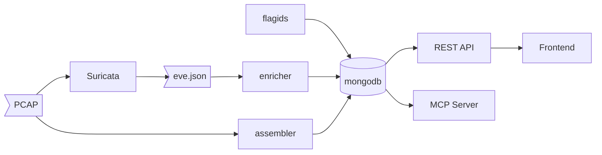

# Services

| Name                | Lang       | Description                                                           |
| ------------------- | ---------- | --------------------------------------------------------------------- |
| /frontend           | React+Vite | Web interface for visualizing and interacting with the analyzed pcaps |
| /services/api       | Golang     | REST API for querying the pcap data                                   |
| /services/assembler | Golang     | Reads pcap streams, analyzes them, and stores the results in MongoDB  |
| /services/enricher  | Golang     | Reads an eve.json file and adds labels to the flows in MongoDB        |
| /services/mcp       | Golang     | Model Context Protocol server for AI tools                            |
| /services/flagsid   | Python     | Queries Flag IDs and stores them in MongoDB                           |
| /services/suricata  | External   | Files and config for Suricata                                         |

## Diagram



## MongoDB structure

We use a single collection for all the pcaps
Each document will have:

```json
{
  "inx": //progressive flow index inside pcap
  "time": //start timestamp
  "duration": //end_time-start_time
  "src_ip": "127.0.0.1",
  "src_port": 1234 ,
  "dst_ip": "127.0.0.1",
  "dst_port": 1234,
  "contains_flag": //true if the importer have found that the flow contains a flag based on the env var regex
  "flow": [
      {
          "data": "...", // session data (capped at 15 MB)
          "from": "c" // "c" for client, "s" for server
          "time": //timestamp
      },
      ...
  ],
}
```

## API

All the end-points return an object or an array of objects.

##### POST /query

Accept the following payload

```json
{
  "flow.data": "regex on data field of flow",
  "dst_ip": "1.2.3.4",
  "dst_port": "1.2.3.4",
  "time": {"$gte": from_millis, "$lt": to_millis}
}
```

It returns an array of documents, WITHOUT the "flow" field

##### `GET /services`

Returns informations about all services. It is configurable via the .env file.

##### `GET /flow/(flow_id)`

Returns the all document with `flow_id` id, including the field `flow`

##### `GET /star/(flow_id)/(0,1)`

Set the flow favourite (1) or not (0)

##### `POST /to_python_request/(tokenize)`

convert the request to python syntax. Tokenize is used to toggle the auto-parsing of args.

##### `GET /to_pwn/(id)`

Convert the flow with the specified id in pwntools syntax
